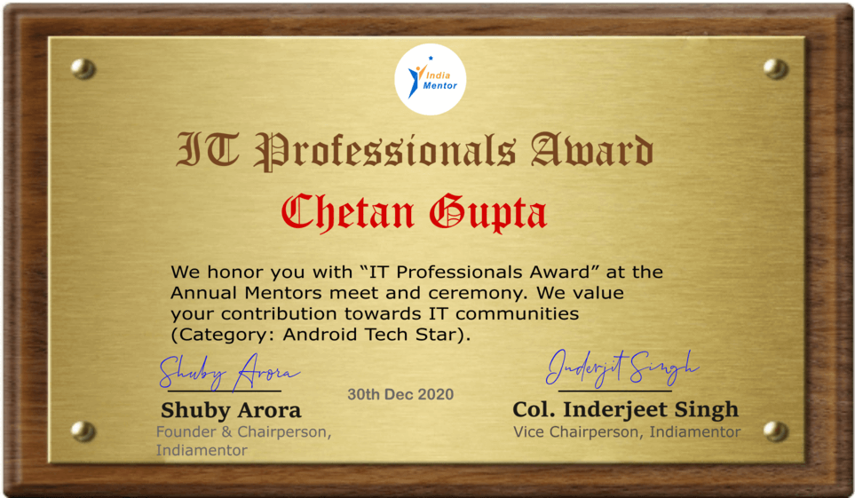

# Hello World! 

Myself `Chetan Gupta`, I go in community with the name `Ch8n`. I'm a mobile technology enthusiast! love Android __kotlinAlltheWay__, want to explore all opportunity around it! 

### CodingMantra
`#cleanCoder #TDD #SOLID #designpatterns`

## [About Me](https://chetangupta.net/about/) 🙋‍♀️ 

- 🚀 A Passionate Android Developer 
- :trophy: Kotlin Fan boy 
- 🔭 I’m currently working on Big-Brain-Kotlin Book!.
- 🌱 I’m currently learning Compose and Kotlin Multi-platformer. 
- 👯 I’m looking to collaborate on YouTube
- 🥅 2020 Goals: Contribute more to Open Source projects
- ⚡ Fun fact: I'm 👨🏻‍💻 by :sunny: and :guitar: by :full_moon_with_face:

### Not Enough? check :point_right: [here](https://chetangupta.net/about/) 
 

## Blogs
I do `Android` and `Kotlin` blogging at  

  

### Hacktober

### Popular blogs
- [Yet Another View Binding Article?](https://chetangupta.net/viewbinding/)
- [Hold on ✋🏻 Before you Dagger or Hilt! try this Simple DI.](https://chetangupta.net/native-di/)
- [Big-Brain-Series #6: The Morse Code 🤫](https://chetangupta.net/bbk6/)
- [AndroidBites | 5 Steps to LRU Cache in Repository.](https://chetangupta.net/cache-repository/)
- [Init Blocks will never haunt you again 👻!](https://chetangupta.net/init-blocks/)
- [Accumulator Pattern for beginners | Fold vs Reduce](https://chetangupta.net/reduce-fold/)
- [6 Things you need to know before using Destructuring in Kotlin.](https://chetangupta.net/destructuring-limitations/)

### Featured In
  

  

  

   

  

## Awards

<a href="https://github.com/ch8n/ch8n/blob/main/Chetan_Gupta.png" target="_blank">
  <figure align="center">
    
  <figcaption>Android Tech Star | India Mentor</figcaption>
  </figure>
</a> 
 
<a href="https://github.com/ch8n/ch8n/blob/main/magniffect-award.png" target="_blank">
  <figure align="center">
    
  <figcaption>Nominee for Korea Mobile Brand Awards |  Korea Mobile Brand Awards </figcaption>
  </figure>
</a> 

## Languages
  

## Technologies

   

## Made in Kotlin with :heart:

<a href="https://github.com/ch8n/Expanding-Cards-Compose">
  
Jetpack Compose | horizontal expanding cards

  
</a>

<a style="margin-left:12px" href="https://github.com/ch8n/KorgeSample">
  
Korge | Game development in Kotlin

    
</a> 

<a href="https://github.com/ch8n/morse-code-kt">

Clikt | CLI application in Kotlin

 
</a> 
 

## 📊 Github Stats

 
 

<a href="https://github.com/ch8n">
  
  
  
   
   
  
</a>

<h3> Have a question? Ask me anything 👉 <a href="https://github.com/ch8n/ch8n/issues/new"><b>here</b></a> 
</h3>

## Stalk Me 👀

     

   

 

</p≈>